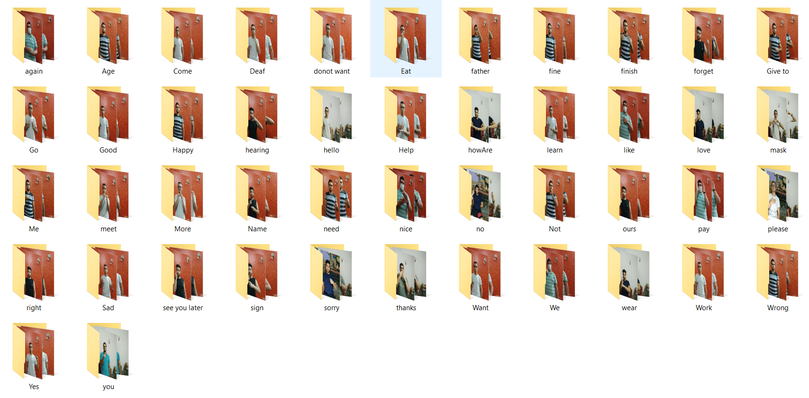

# Light-Weight Deep Learning Model for Dynamic Sign Language Recognition

<p align="center">
  
  
  
</p>

Dynamic Hand Gestures recognition in Video Sequences and in Real-Time recognition using the Deep Learning models and the MediaPipe framework.

### Prerequisites

The following prerequisites are required to make this repository work:
- Download the source code or clone the repository [here](https://github.com/gerges-hanna/Sign-Language-Recognition)
- Install the following libraries : 
  
  Install opencv:
  ```shell
  pip install opencv-python
  ```
  Install tensorflow:
  ```shell
  pip install tensorflow
  ```
  
- Prepare a Dynamic Sign Language Dataset
- The Dataset folder should contain sub-folders equal to the number of signs labeled with the name of the sign as shown 
<p align="center">
  
</p>

If you don’t have a Dataset for Dynamic Sign Language, use our dataset which is available for free for educational purposes. Try the [DSL-46 Dataset](https://www.google.com).

# Getting started
#### Run the main.py script 
The model contain 3 main parts
- Extract keypoints
- Train the model
- Real-Time run


### 1- Extract keypoints
Before extracting intialize the n_thread parameter with the number of threads 
Enter "1" for the selection as shown 
<p align="center">
  
</p>
After the selection follow the on-screen system questionare that will ask for this inputs

- Enter the name of the dataset
- Enter the directory for the dataset
- Enter the number of frames to be extracted from each video
- Choose the extractation type
- in addition to the hands, Do you need to extract the pose or face points 
- Do you 


