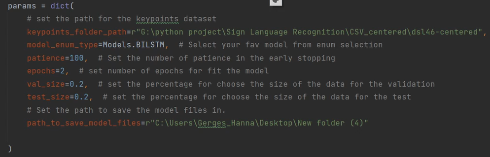

# Light-Weight Deep Learning Model for Dynamic Sign Language Recognition

<p align="center">
  
  
  
</p>

Dynamic Hand Gestures recognition in Video Sequences and in Real-Time recognition using the Deep Learning models and the MediaPipe framework.

### Prerequisites

The following prerequisites are required to make this repository work:
- Download the source code or clone the repository [here](https://github.com/gerges-hanna/Sign-Language-Recognition)
- Install the following libraries : 
  
  Install opencv:
  ```shell
  pip install opencv-python
  ```
  Install tensorflow:
  ```shell
  pip install tensorflow
  ```
  
- Prepare a Dynamic Sign Language Dataset
- The Dataset folder should contain sub-folders equal to the number of signs labeled with the name of the sign as shown 
<p align="center">
  
</p>

If you don’t have a Dataset for Dynamic Sign Language, use our dataset which is available for free for educational purposes. Try the [DSL-46 Dataset](https://www.google.com).

# Getting started
The model contains 3 main parts
- Extract keypoints
- Train the model
- Real-Time run


### 1- Extract keypoints
This phase is used to extract the keypoints from the given dataset through MediaPipe framework.

_Before extracting initialize the n_thread parameter with the number of threads_

#### Run the main.py script 
Enter "1" for the selection as shown 
<p align="center">
  
</p>
After the selection follow the on-screen system questionnaire that will ask for these inputs

- Enter the name of the dataset
- Enter the directory for the dataset
- Enter the number of frames to be extracted from each video
- Choose the extraction type
- in addition to the hands, Do you need to extract the pose or face points 
- Do you need to process the scale (Depth)
- Enter the directory to save the folder
- Enter the folder name

#### Answer the following questions depending on your situation following the on-screen commands 

A snapshot example for the run: 
<p align="center">
  
</p>

note: the snapshot was captured before adding the advanced technique for processing the scale

After a successful run, all the occupied threads should complete 100% as shown
<p align="center">
  
</p>

Then two CSV files should be saved in the input directory as shown

<p align="center">
  
</p>

- Dataset CSV file: contain the first column to show the labels of the dataset, while the rest columns shows the extracted keypoints 
- Meta-Data CSV file: it contains the seven meta-data for the exctration process as shown in the next table

#### Meta-Data

| Data Label                     | Description                                |
| ----------------------------- | ------------------------------------------ |
| `dataset`                        | Shows the dataset name as pre input. |
| `keypoint_extractor_type`                  | Shows the extraction type as pre input. |
| `sequence_length`         | Shows the number of frames as pre input. |
| `n_words` | Shows the number of the signs in the used dataset. |
| `n_samples`                 | Shows the number of samples in each sign from the used dataset. |
| `count_of_features`        | Shows the number of the extracted features. |
| `extracted body parts` | Shows the extracted parts of the body. |

### 2- Train the model
This phase is used to train the model, the process starts by reading the meta-data and the dataset keypoints from the pre extracted CSV files.

Then, the following actions will be made respectively to suit the model:
- Reshape the data and lables
- Set the shape of the input and the output
- Encode the labels
- Split the data into train, test and validation samples

_Before the training process intialize the following params depending on your situation_
<p align="center">
  
</p>

#### Run the main.py script 
Enter "2" for the selection as shown 
<p align="center">
  
</p>
After the selection follow the on-screen system questionnaire that will ask for these inputs


